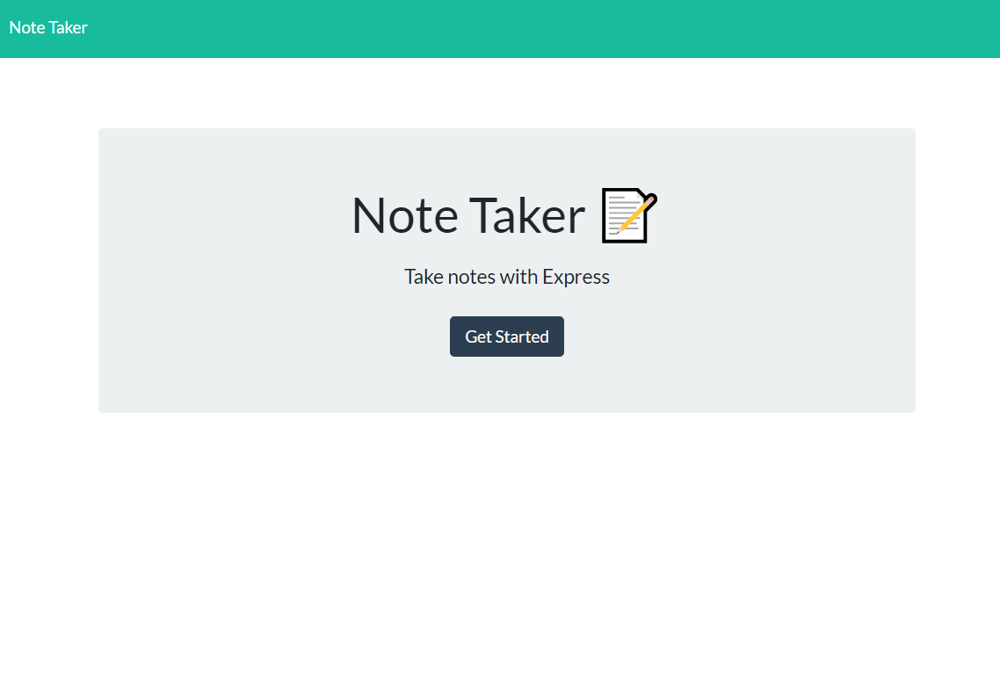
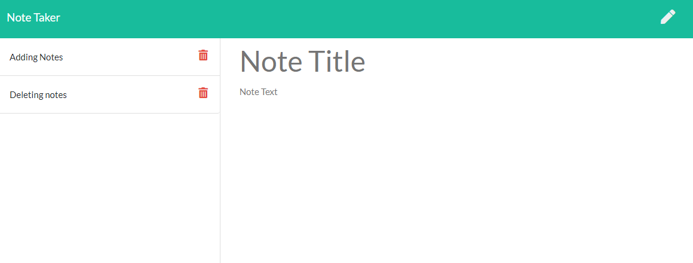

# NoteTaking

## Overview
Professional Portfolio to showcase work and areas of expertise for potential employers. 

## Table of Contents
* [Preview](#Preview)
* [Links](#Links)
* [Objectives](#Objectives)
* [Installation](#Installation)
* [Credit](#Credit)

## Preview

 

## Links
Visit the site at : https://notetakerhana.herokuapp.com/

## Objectives
Using Express servers, create a note taking app to do the following:

* Write notes with title and body
* Store notes attaching a unique ID 
* Have save notes persist after reloading, or if going to different service
* Able to delete notes that are no longer needed

## Systems Used
* HTML  
* CSS
* Javascript
* Nodejs
* Express

## Installation
To install for yourself, type   
    `npm i`   
and then run using node. 

## Credit 
HTML, CSS, Javascript assets provided.
Server code written by me.   